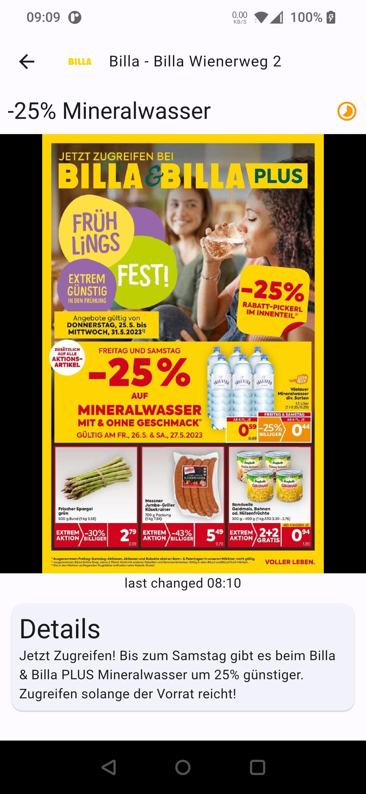
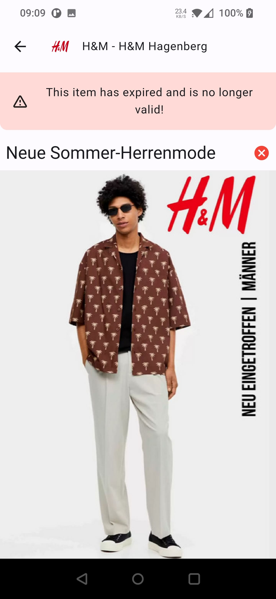
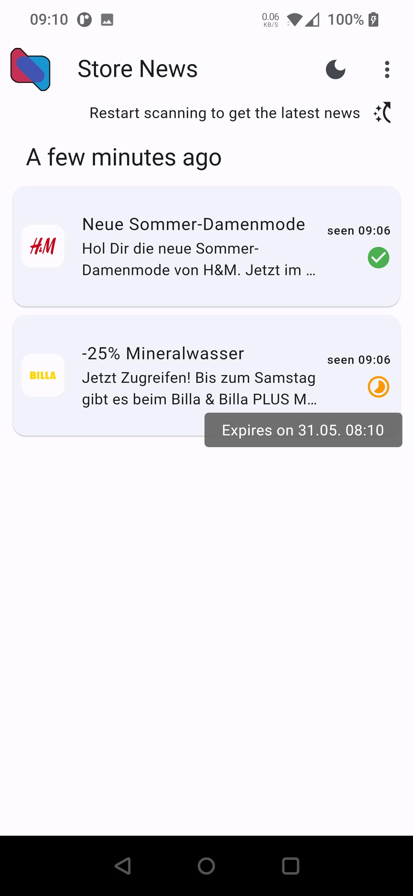
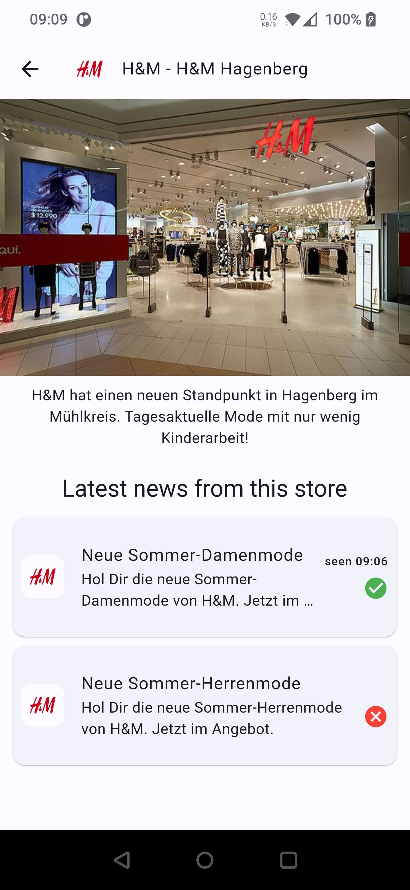
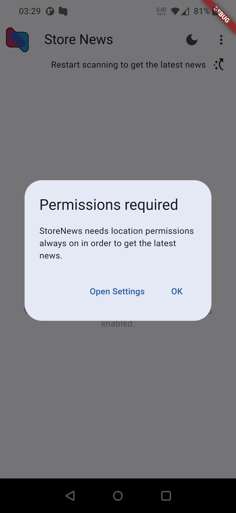
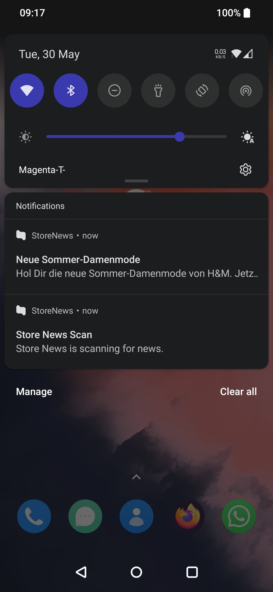
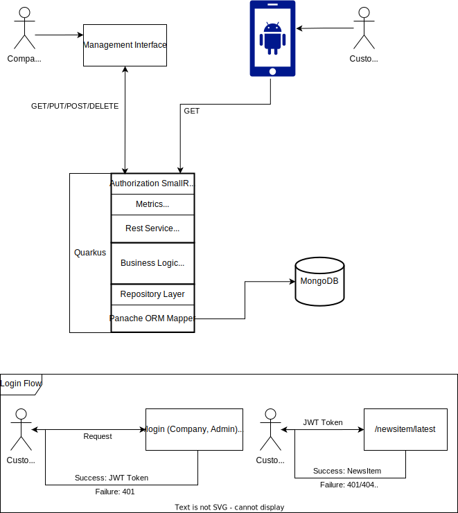

# StoreNews.App (Flutter App &amp; MUS2UE Project)
*Stay informed on the go with StoreNews.*

## Showcase
https://github.com/malthee/StoreNews.App/assets/18032233/7c07a171-4311-4a33-9409-ca33b56e2b66

|  Details |   |
|---|---|
|   |    |

| Overview | Store |
|---|---|
|   |    |


| Permissions | Notifications |
|---|---|
|   |    |

Also see the rough sketches in the [doc folder](./doc/sketches.md).

The mix between english and german is intended, as the app does support internationalization, but the data is defined in the language of the store (in this case german). 

## Installation & Usage
To install the example application perform the following steps:

* Prerequisites: Flutter SDK & supported IDE, Java JDK 17+, one or more iBeacons and a running Docker instance (for the backend)
* Download the latest release from https://github.com/malthee/StoreNews.App/releases/
* Navigate to `/backend/StoreNews` and either run it with maven or perform `quarkus dev` to start
* Navigate to `/app/StoreNews`
  * Run `flutter pub get` to install the dependencies
  * Run `flutter run` to start the app (should be run on a real device to find beacons)
* Be in possesion of iBeacons and configure their UUID to the value defined in `util/constants.dart`. Also configure the major and minor values to the store and company number, which are either returned by the service when a new resource is created, or can be on of the example data company/store combinations: ((1,1),(1,2),(2,1)).
  * To configure beacons there are many apps available. For Android there is the `BlueBeaconManager`.
## Problem Statement
Store promotions or offers are often overlooked, even though they may be of interest to people passing by. With the help of cleverly placed Bluetooth beacons (as part of Smart City) and a smartphone app, users can receive relevant information in real time. This not only improves the shopping experience, but also enables stores to optimize their marketing strategies and attract potential customers in new ways. 

### User Story
As a user, I want to be able to:  
- [x] Get the latest news of stores on the go. 
- [x] Get notified (but not too often) when I walk past a store that has a new offer.
- [x] View the details of news or offers.
- [x] View and zoom in on news images.
- [x] View the profile of a store with all its latest news and offers.
- [x] See how long offers are valid for.
- [x] Stop the scanning to save battery life and continue when I want to.
- [x] Use dark or light mode.

## Solution
* A Quarkus backend that provides a REST API for the app to fetch data from.
* A flutter app that scans for beacons, fetches data from the backend and displays it to the user.

### Tech Stack
* Flutter (Dart)
  * Material Design 3
  * beacon_plugin (Bluetooth beacons, personalized implementation)
  * i18n (internationalization, only English implemented but extendable)
  * get_it (dependency Injection)
  * flutter_local_notifications (notifications)
  * http (connecting to REST API)
  * permission_handler (request and check permissions)
  * photo_view, carousel_slider (image views, zoomable, scrollable)
* Android (Kotlin)
* Quarkus (Java)
* MongoDB

## Architecture
### Data flow inside the Flutter app:


For beacon scanning the `beacon_plugin` is being used. Because it didn't fit the requirements of the project, it was extended on a repository fork. As the app needs to work in the background the plugin uses an android foreground service. This is why a sticky notification is being displayed when the app is in background. The scanning is started and stopped by the `BeaconManager` and is configured in the `util/constants.dart` file.

Inside of the app the flow is handled by `Streams` and `StreamSubscriptions`. Starting with the Beacons Plugin, a subscription to the beacon range events is added. These values are then parsed in the `BeaconManager`. The result is extracted with the relevant data:
```json
BeaconInfo
{
  "major": "int",
  "minor": "int",
  "distanceMeter": "double"
}
```
The `NewsManager` then uses the `major and minor` to identify the company and store and fetch the latest news accordingly. This process is also checks if news for the store should be checked -> enough time has passed and the user is close to the beacon. The `NewsManager` then provides a `NewsItem` object:
```json
NewsItem
{
    "id": "string",
    "storeNumber": "int",
    "companyNumber": "int",
    "name": "string",
    "markupContent": "string",
    "lastChanged": "DateTime",
    "expires": "DateTime",
    "detailImageId": "string",
    "scannedAt": "DateTime"
}
```
This `NewsItem` is then shown in the main overview of the app. If the app is in background, a notification will be shown by the `NotificationManager`. If the user clicks on the notification, the app will be opened and the `NewsItem` will be shown in the detail view.

### Frontend architecture:


* UI is separated into `pages` and `widgets` that define the display logic
* `services` provide the data from the REST backend, also do the authorization workflow
* `managers` handle the data flow inside the app using streams and listeners
* `domain` is used across the application, defines the data models
* `util` as well contains helper classes and functions
* `i18n` contains the internationalization files

## Backend architecture:



The backend is a REST API that provides the data for the app. It is written in Java with Quarkus and uses MongoDB as a database. It has an authentication system, where JWT requests are required to access the resources. Customers get a token with limited access, but they don't need to login. Company representatives can login and edit their data, publish new NewsItems. 

## Future TODOs
- [ ] Add more languages
- [ ] Try out Flutter testing
- [ ] Overview of stores near the user
- [ ] Rich Text support in news, clickable links (with security)
- [ ] Design improvements: better list design, fancier UI elements
- [ ] Load more news when scrolling down in the store view
- [ ] Secure (HTTPS) communication with backend

## Disclaimers
* This is just a technical demonstration not a REAL PRODUCT. All images used belong to their respective copyright holders. If you are the owner if one of the used images and you do not agree with the usage please contact me.


